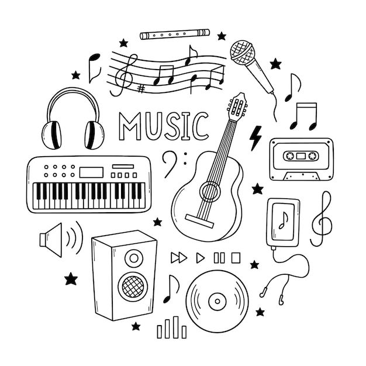
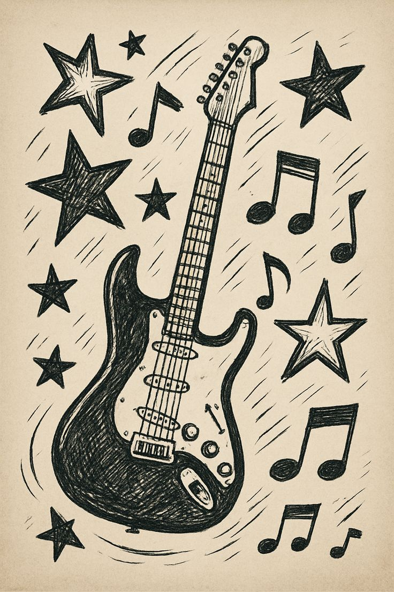
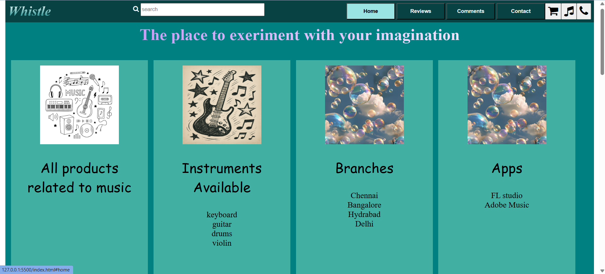
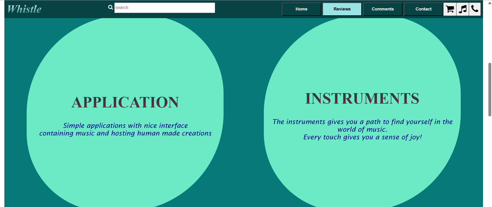
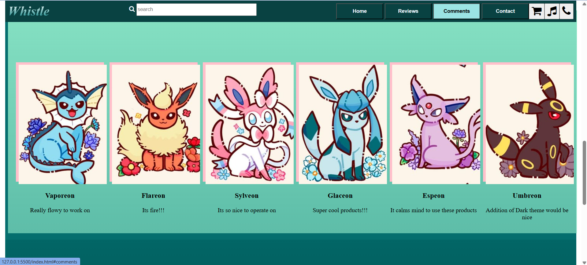
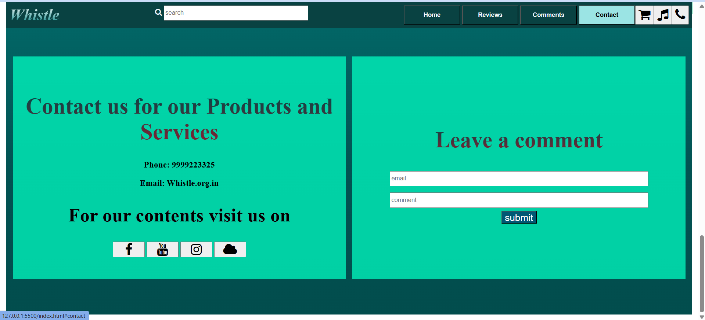

# Ex02 Commercial Website
## Date:

## AIM
To create a commercial website using CSS Flexbox.

## ALGORITHM
### STEP 1
Create an HTML file (index.html)

### STEP 2
Create a CSS file (style.css)

### STEP 3
Include a navigation bar with links to different sections.

### STEP 4
Add structured sections for Homepage, Products / Services, About Us, Contact Details and User Account.

### STEP 5
Include social media links at the footer with copyright information.

### STEP 6
Define global styles for fonts, colors, and layout.

### STEP 7
Style the header, navigation bar, and sections.

### STEP 8
Use Flexbox for layout design.

### STEP 9
Add hover effects and transitions for interactivity.

### STEP 10
Add Images and Media.

### STEP 11
Use optimized images for a professional look.

### STEP 12
Open the HTML file in a browser to check layout and functionality.

### STEP 13
Fix styling issues and refine content placement.

### STEP 14
Deploy the website.

### STEP 15
Upload to GitHub Pages for free hosting.

## PROGRAM
index.html
```
<!DOCTYPE html>
<html lang="en">

<head>
    <meta charset="UTF-8">
    <meta name="viewport" content="width=device-width, initial-scale=1.0">
    <title>Document</title>
    <link rel="stylesheet" href="https://cdnjs.cloudflare.com/ajax/libs/font-awesome/4.7.0/css/font-awesome.min.css">
    <link rel="stylesheet" href="styles.css">
</head>

<body>
    <nav>
        <div class="word">Whistle</div>
        <div>
            <i class="fa fa-search" style="color: aliceblue;"></i>
            <input type="text" placeholder="search">
        </div>
        <div style="display: flex;">
            <div class="but">
                <a href="#home"><button>Home</button></a>
                <a href="#products"><button>Reviews</button></a>
                <a href="#comments"><button>Comments</button></a>
                <a href="#contact"><button>Contact</button></a>

            </div>

            <button class="icon">
                <i class="fa fa-shopping-cart"></i>
            </button>
            <button class="icon">
                <i class="fa fa-music"></i>
            </button>
            <button class="icon">
                <i class="fa fa-phone"></i>
            </button>
        </div>
    </nav>

    <section class="home" id="home">
        <div style="margin-top:8vh;">
            <h2>The place to exeriment with your imagination</h2></div>
        <div style="display: flex;">
            <div class="col">
                
                <p>All products related to music</p>
            </div>
            <div class="col">
                

                <p>Instruments Available</p>
                <div class="sent">keyboard<br>guitar<br>drums<br>violin </div>


            </div>
            <div class="col">
                
                <p>Branches</p>
                <div class="sent">Chennai<br>Bangalore<br>Hydrabad<br>Delhi</div>
            </div>
            <div class="col">

                

                <p>Apps</p>
                <div class="sent"> FL studio<br>Adobe Music</div>
            </div>
        </div>
    </section>

    <section class="products" id="products">
        <div class="pdiv">
            <h1>APPLICATION</h1>
            <p>Simple applications with nice interface <br> containing music and hosting human made creations </p>

        </div>
        <div class="pdiv">
            <h1>INSTRUMENTS</h1>
            <p>The instruments gives you a path to find yourself in the world of music.<br>Every touch gives you a sense
                of joy!</p>
        </div>

    </section>

    <section class="comment" id="comments">
        <span>Add a comment</span>
        <div class="ccol">
            <div>
                <div class="eevee eevee1"></div>
                <h3>Vaporeon</h3>
                <p>Really flowy to work on</p>
            </div>
            <div>
                <div class="eevee eevee2"></div>
                <h3>Flareon</h3>
                <p>Its fire!!!</p>
            </div>
            <div>
                <div class="eevee eevee6"></div>
                <h3>Sylveon</h3>
                <p>Its so nice to operate on</p>
            </div>
            <div>
                <div class="eevee eevee5"></div>
                <h3>Glaceon</h3>
                <p>Super cool products!!!</p>
            </div>
            <div>
                <div class="eevee eevee3"></div>
                <h3>Espeon</h3>
                <p>It calms mind to use these products</p>
            </div>
            <div>
                <div class="eevee eevee4"></div>
                <h3>Umbreon</h3>
                <p>Addition of Dark theme would be nice</p>
            </div>

        </div>
    </section>

    <section class="contact" id="contact">
        <div>
            <h1>Contact us for our Products and Services</h1>
            <h3>Phone: 9999223325</h3>
            <h3>Email: Whistle.org.in</h3>
            <h2 style="color: black;">For our contents visit us on </h2>
            <button class="icon">
                <i class="fa fa-facebook"></i>
            </button>
            <button class="icon">
                <i class="fa fa-youtube"></i>
            </button>
            <button class="icon">
                <i class="fa fa-instagram"></i>
            </button>
            <button class="icon">
                <i class="fa fa-cloud"></i>
            </button>
        </div>
        <div>
            <h1>Leave a comment</h1>
            <input type="text" placeholder="email"><br>
            <input type="text" placeholder="comment"><br>
            <button style="font-size: 3vh;background-color: rgb(0, 87, 116);color: rgb(255, 255, 255);">submit</button>
        </div>
    </section>
</body>

</html>
```
styles.css
```
        html,body{
            margin:1vh;
            min-width: 80vh;
        }
        nav{
            padding:1vh;
            top: 0;
            min-width: 97.2vw;
            background-color: rgb(9, 66, 66);
            display: flex;
            justify-content:space-between;
            box-sizing: border-box;
            position:fixed;
        }
        nav .word{
            font-size: 5vh;
            font-style: italic;
            font-weight:800;
            background-image: linear-gradient(white,teal);
            background-clip:text ;
            color: transparent;
        }

        .but button{
            height: 6vh;
            min-width: 8vw;
            color: aliceblue;
            background-color: transparent;
            font-weight:600;
            transition:0.5s ease

        }
        .but button:hover{
            background-color: rgb(155, 228, 228);
            color: black;
        }
        nav input{
            height: 4vh;
            min-width: 20vw;
        }
        .icon {
            min-height:5vh;
            font-size: 4vh;   

        }
        
        .home{
            padding: 1vh;
            min-height: 97.5vh;
            min-width: none;
            background-color: teal;
            align-items: center;
            align-content: center;
            text-align: center;
        }   
        .products{
            min-height: 100vh;
            background-color: rgb(7, 121, 121);
            align-content: center;
            text-align: center;
            display: flex;
            justify-content: space-around;
            padding: 1vh;
            align-items: center;
        }
        .col{
            margin: 1vh;
            /* background-color: rgb(134, 225, 195); */
            background-color:rgba(134, 225, 195, 0.487) ;
            min-height: 80vh;
            width: 50vh;
            align-items: center;
            align-content: center;
            text-align: center;
            display: flex;
            flex-direction: column;
            padding: 2vh;
            box-sizing: border-box;
            transition: 0.3s ease;
        }
        .col:hover{
            border: 0.5vh solid black;
            background-color:rgba(134, 225, 195) ;

        }
        .col p{
            font-family:cursive;
            font-size: 5vh;
        }
        .sent{
            font-size: 3vh;
        }
        .pdiv{
            background-color: rgb(127, 255, 212, 0.845);
            /* min-height: 80vh; */
            width: 40vw;
            aspect-ratio: 1 /1;
            border-radius: 50% 40%;
            align-content: center;
            text-align: center;
            box-sizing: border-box;
            transition: 0.3s ease;
        }
        .pdiv:hover{
            background-color: rgb(97, 202, 167);
            border: 1vh double black;
        }
        .pdiv p{
            font-size: 3vh;
            font-family: 'Lucida Sans', 'Lucida Sans Regular', 'Lucida Grande', 'Lucida Sans Unicode', Geneva, Verdana, sans-serif;
            color:darkblue;
            font-style:italic ;
        }
        .comment{
            background-color: rgb(5, 110, 110);
            min-height: 90vh;
        }
        .ccol{
            margin: 1vh;
            /* background-color: rgb(134, 225, 195); */
            background-image: linear-gradient(rgb(134, 225, 195),rgba(134, 225, 195, 0.687)) ;
            min-height: 80vh;
            width: 210vh;
            align-items: center;
            align-content: center;
            text-align: center;
            padding: 2vh;
            display: flex;
        }
        .ccol div{
            width: 15vw;
            height: 45vh;
            background-color: pink;
            margin: 1vh;
            align-items: center;
            align-content: center;
            box-sizing: border-box;
        }
        .ccol div:hover{
            background-color: rgb(238, 126, 145);
            font-size: 3vh;
            color: aliceblue;
            border: 1vh solid black;

        }
        .eevee{
            height: 10%;
            width:80%;
            background-image: url(images/eeve.jpg);
        }
        .eevee1{background-position: -20px -35px;}
        .eevee2{background-position: -255px -25px;}
        .eevee3{background-position: 0px -350px;}
        .eevee4{background-position: -470px -330px;}
        .eevee5{background-position: 0px -660px;}
        .eevee6{background-position: -240px -680px;}

       .contact{
            min-height: 90vh;
            background-image: linear-gradient(rgb(2, 102, 102),rgb(2, 82, 82),rgb(2, 77, 77));
            padding: 1vh;
            display: flex;
            align-items: center;
        }
        .contact div{
            margin: 1vh;
            width: 50vw;
            min-height: 70vh;
            background-color: rgba(0, 255, 195, 0.737);
            align-content: center;
            align-items: center;
            text-align: center;
            transition: 0.5s ease;
        }
        .contact div:hover{
            background-color: rgb(154, 250, 227);

        }
        h1{
            font-size: 7vh;
            background-image: linear-gradient(rgb(3, 71, 71),rgb(134, 32, 49));
            background-clip: text;
            color: transparent;
        }
        .contact div input{
            width: 80vh;
            height: 4vh;
            margin:1vh
        }
        .contact div button{
            min-width: 10vh;
            height: 4vh;
        }
        h2{
            font-size: 6vh;
            background-image: linear-gradient(90deg,rgb(182, 130, 241),white);
            background-clip: text;
            color: transparent;    
        }
```

## OUTPUT
home page:

review page:

comments page:

contact page:

git hub link for the hosted project : https://Haripriya132006.github.io/Commercial_Website/

## RESULT
The program for creating commercial website using CSS Flexbox is executed successfully.
